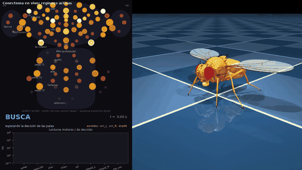

# 🪰🧠 fly-connectome-mujoco

**El conectoma completo de *Drosophila* (166,700 neuronas) controlando un cuerpo físico simulado en MuJoCo.**
*Whole-brain Drosophila connectome driving a physics-simulated fly: it forages by smell, eats, escapes a predator by flight and lands — with decisions read from the real wiring.*

> Una mosca virtual que **busca comida, come, huye de un depredador volando, aterriza y vuelve a comer**
> en un mundo 3D — con las decisiones tomadas por la simulación de su **cerebro real**: las
> 166,700 neuronas y 6.2 millones de conexiones del conectoma del sistema nervioso central de la
> mosca macho (Princeton / Janelia / Google, 2026). Hecho en una PC de casa en dos días.



**▶ Video completo:** [`videos/final/vida_de_mosca.mp4`](videos/final/vida_de_mosca.mp4) ·
**Panel izquierdo:** las 107 regiones del cerebro y el cordón nervioso coloreadas por la actividad
real del conectoma · **Panel derecho:** el cuerpo físico en MuJoCo.

---

## Qué hace la mosca (y quién lo decide)

| Momento | Estímulo que recibe el conectoma | Circuito real que responde | Lo que pasa |
|---|---|---|---|
| **Busca** | Olor de la comida en las neuronas receptoras olfativas izq/der; "hambre" en las 2 neuronas de comando **DNp09** | 300+ motoneuronas de patas; las neuronas de proyección olfativas codifican **de qué lado** viene el olor | Camina hacia la comida. El rumbo sale del índice izquierda/derecha de su propio cerebro — **sin instrucción de dirección** |
| **Come** | 275 neuronas gustativas de la cabeza | Motoneuronas de probóscide **MN1–MN13** suben de ~14 a ~30 Hz | Extiende la probóscide; la extensión **es** la tasa de disparo |
| **Huye** | Un depredador se acerca → detectores de expansión visual **LPLC2** | **Giant Fiber → TTMn** (la neurona del músculo del salto) dispara ~780 ms después | Salta y escapa volando |
| **Vuela / aterriza** | Olor de la segunda comida | Índice lateral olfativo (rumbo); neuronas descendentes activadas por el olor (decisión de bajar) | Vuela hacia el olor, aterriza a 1 cm de la comida, camina, come, descansa |

Nada de eso está cableado a mano: los caminos DNp09→patas, gusto→probóscide, LPLC2→Giant Fiber→TTMn
y la lateralidad olfativa **emergen del CSV del conectoma**. Lo que sí es del guion está en la sección
de honestidad más abajo.

## Principales hallazgos

1. **Los reflejos están en el cableado, no en el tamaño de la red.** Con un conectoma *barajado*
   (mismas neuronas, mismos pesos y signos, destinos al azar) el estímulo visual de amenaza produce
   **0 spikes** en TTMn frente a **38** con el real, y el gusto casi no llega a la probóscide (2 vs 11
   motoneuronas). Ese cerebro no comería ni huiría.
2. **Estimular 2 neuronas (la Giant Fiber) activa exactamente 1 motoneurona de 815: TTMn**, la del
   salto — el reflejo de escape más estudiado de la mosca, reproducido con 36 spikes en todo el cerebro.
3. **El cerebro simulado sabe de qué lado viene el olor… en las etapas tempranas.** Las neuronas de
   proyección del lóbulo antenal y las células de Kenyon codifican la proporción izquierda/derecha del
   olor de forma monótona; las neuronas descendentes ya no. Leyendo esa señal temprana (con una
   calibración del sesgo de base) la mosca llega a la comida **6 de 6 veces** desde 0°, ±60°, ±120° y
   180°, en tierra y en vuelo.
4. **Un conectoma congelado acelera el aprendizaje por refuerzo.** Con el cerebro en el lazo, PPO llegó a
   191 de recompensa frente a 169 sin cerebro (misma tarea, mismos pasos); el barajado, 147. Parte de la
   ventaja es "efecto reservorio", pero el barajado *empeoró* frente a no tener cerebro.
5. **Reward hacking en vivo:** con la recompensa "haz girar la bola", tanto la red genérica como la
   guiada por el conectoma aprendieron a remar con las patas delanteras arrastrando las traseras. La
   recompensa define *qué* se aprende; el cerebro sólo cambia *cuánto*.
6. Latencias que nadie programó: caminar 15 ms tras el comando, comer ~180 ms tras saborear, saltar
   ~780 ms tras aparecer la amenaza.

Todo el detalle, con los experimentos fallidos, en [**BITACORA.md**](BITACORA.md).

## Cómo está armado

```
escena (mundo, olor, comida, depredador)
   │  codificación sensorial: qué neuronas se estimulan y a qué frecuencia
   ▼
CONECTOMA REAL  (166,700 neuronas LIF, 6.2M sinapsis con signo, umbral único)   ← src/sim_brain.py
   │  lecturas: motoneuronas de patas / probóscide / TTMn, DN olfativas, índice lateral olfativo
   ▼
máquina de estados (BUSCA · COME · ESCAPA · VUELA · ATERRIZA · DESCANSA)          ← src/vida_de_mosca.py
   │  fantasma-guía (rumbo, velocidad, altura)
   ▼
CUERPO flybody en MuJoCo, patas + alas + probóscide en una sola física            ← src/mundo_abierto_env.py
   políticas de caminata y vuelo de Janelia/DeepMind (imitación de moscas reales)  ← src/janelia_policy.py
   mapa de regiones por actividad                                                  ← src/cerebro_regiones.py
```

## Honestidad: qué es del cerebro y qué es del guion

- **Del cerebro real:** qué se activa ante cada estímulo, cuándo (latencias), cuánto (la probóscide),
  de qué lado viene el olor, y qué regiones se encienden. Y las pruebas de control con el barajado.
- **Del guion:** el mundo y sus eventos; la codificación sensorial (qué neuronas estimula cada cosa);
  qué poblaciones se leen y sus umbrales; la máquina de estados que traduce lecturas en acciones; la
  exploración en zigzag/círculos *cuando no hay olor*; la ejecución motora fina (políticas de Janelia);
  el salto de despegue y la nivelación al aterrizar (cambios instantáneos de postura).
- **Simplificaciones del modelo:** neuronas *leaky integrate-and-fire* con un único umbral global y
  peso = número de sinapsis; el mapa de regiones es un esquema anatómico, no una malla 3D; la red
  sobre-recluta las motoneuronas de vuelo con casi cualquier estímulo.

## Reproducir

Requiere Python 3.11 (no 3.14), Windows/Linux, CPU (12 núcleos ≈ 10 min por video). Datos: ver
[`data/README.md`](data/README.md) (conectoma ~220 MB + políticas de Janelia 6.5 MB, no incluidos).

```bash
python -m venv .venv && .venv\Scripts\pip install -r requirements.txt
python src\build_brain.py && python src\build_regiones.py           # conectoma -> matriz dispersa + regiones
python src\vida_de_mosca.py                                          # el video principal (~10 min)
python src\dia_de_mosca.py                                           # demo por escenas con raster de motoneuronas
python src\experimento.py --stim tipo:LPLC2 --record tipo:TTMn      # electrofisiología virtual desde la terminal
python src\test_navegacion_cerebral.py 110 60,-60 100                # ¿el cerebro dirige? 
python src\viewer_libre.py                                           # la mosca en el visor interactivo de MuJoCo
```

Más: `src/train_walk.py` / `train_brain.py` / `train_shuffled.py` (fases de RL), `analiza_marcha.py`
(uso de cada pata), `video_*.py`.

## Carpetas

- `src/` código · `videos/final/` los dos demos con sus gráficas y logs · `videos/experimentos_conectoma/`
  rasters de los circuitos · `videos/fases_entrenamiento/` RL con y sin cerebro · `videos/pruebas_cuerpo/`
  pruebas intermedias de caminata, vuelo, despegue y aterrizaje · `modelos/` políticas PPO entrenadas ·
  `logs/` · `BITACORA.md` la bitácora completa.

## Créditos

- Conectoma del SNC de la mosca macho: consorcio FlyWire / Princeton / HHMI Janelia / Google Research (2026).
- Cuerpo y políticas de caminata/vuelo: **flybody** — Vaxenburg *et al.*, *Whole-body physics simulation of
  fruit fly locomotion*, Nature 2025 (Google DeepMind & HHMI Janelia). Datos: Janelia Figshare.
- Simulador de spikes inspirado en Shiu *et al.* 2024 (*Nature*), *A Drosophila computational brain model*.
- MuJoCo, dm_control, Stable-Baselines3.

Código bajo licencia MIT. Los datos y las políticas pre-entrenadas conservan las licencias de sus autores.
